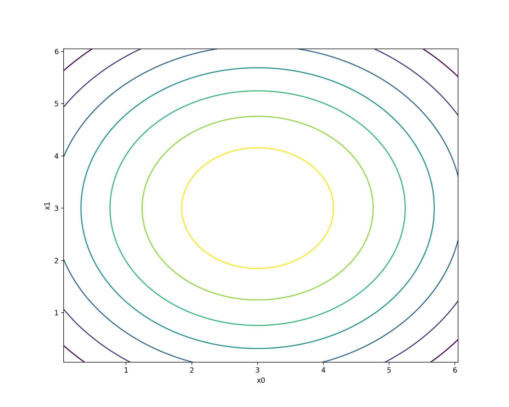
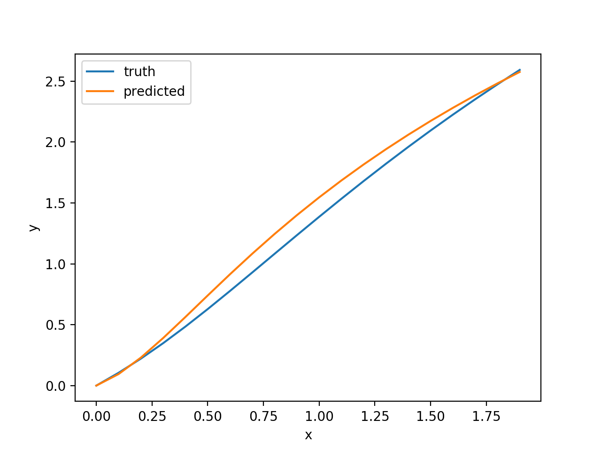
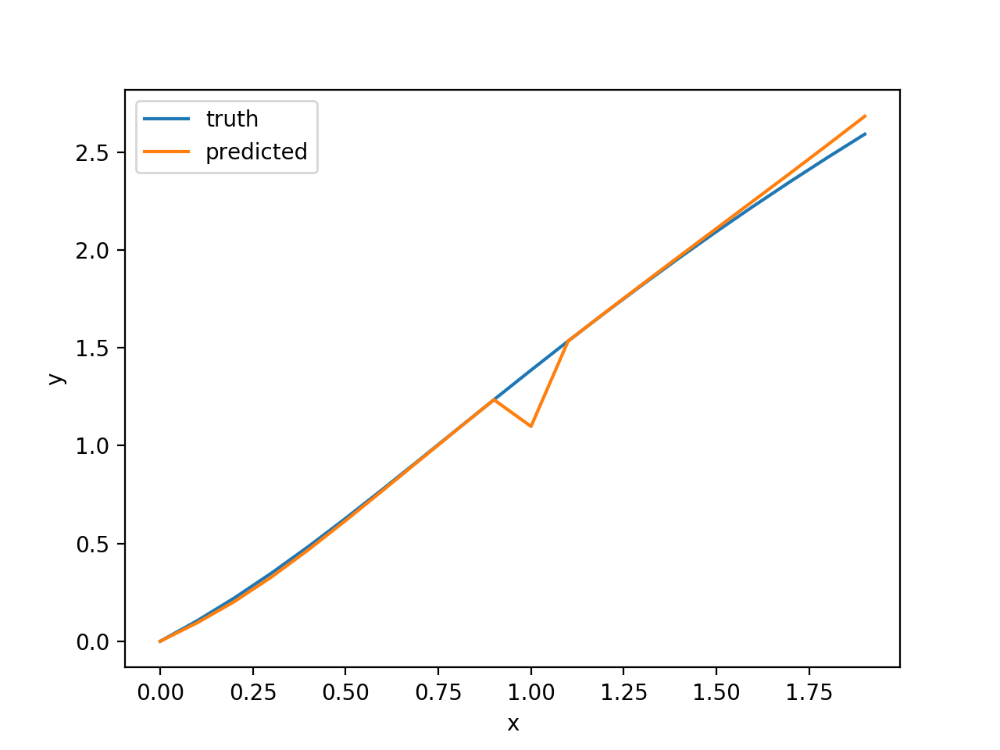

Examples
********

KGP comes with a set of example problems that can be used as guidelines for how to implement your own problems as well as to test the implementation.

This section will provide some information about each example problem and its implementation.

For each example the data used to train the model is described. U[*a, b, c*] is *c* uniform random samples drawn from *a* to *b* inclusive. E[*a, b, c*] is a set of points evenly spaced with an interval of *c* from *a* to *b* inclusive.

The examples are included in the JAR file at  and can be run at the command-line using the following command:

.. code-block:: shell

    java -cp KGP-1.0-SNAPSHOT.jar kgp.examples.<PROBLEM>

where ``<PROBLEM>`` is one of the problems given below (names here).

Basic Regression Problem
========================

``BasicRegressionProblem`` is a simple example that is used in the :doc:`Usage </usage>` section to demonstrate how to use KGP. As results for this example problem have been previously detailed, we will omit them in this section.

The target function is given in Equation 1. The problem's inputs are constrained to the range :math:`[-1, 1]`.

:math:`x_0^2 - x_1^2 + x_1 - 1 \tag{1}`

The table below details the parameters that are used for this problem.

+------------------------+----------------------------------------------+
| Parameter              | Value                                        |
+========================+==============================================+
| Training Data          | U[-1, 1, 100]                                |
+------------------------+----------------------------------------------+
| Tree Depth             | 5                                            |
+------------------------+----------------------------------------------+
| Generation Method      | Half and Half                                |
+------------------------+----------------------------------------------+
| Number of Features     | 2 (:math:`x_0, x_1`)                         |
+------------------------+----------------------------------------------+
| Constants              | :math:`[-1, 0, 1]`                           |
+------------------------+----------------------------------------------+
| Population Size        | 1000                                         |
+------------------------+----------------------------------------------+
| Generations            | 500                                          |
+------------------------+----------------------------------------------+
| Tournament Size        | 20                                           |
+------------------------+----------------------------------------------+
| Crossover Rate         | 70%                                          |
+------------------------+----------------------------------------------+
| Subtree Mutation Rate  | 10%                                          |
+------------------------+----------------------------------------------+
| Hoist Mutation Rate    | 5%                                           |
+------------------------+----------------------------------------------+
| Point Mutation Rate    | 10%                                          |
+------------------------+----------------------------------------------+
| Point Replacement Rate | 5%                                           |
+------------------------+----------------------------------------------+
| Number of Offspring    | 10                                           |
+------------------------+----------------------------------------------+
| Terminals              | :math:`\{x_0, x_1\} \cup constants`          |
+------------------------+----------------------------------------------+
| Functions              | :math:`\{+, -, \times, \div\}`               |
+------------------------+----------------------------------------------+
| Fitness Function       | MAE                                          |
+------------------------+----------------------------------------------+
| Stopping Threshold     | 0.01                                         |
+------------------------+----------------------------------------------+

Quartic Polynomial
==================

The Quartic Polynomial function is defined by Equation 2.

:math:`x^4 + x^3 + x^2 + x \tag{2}`

A small amount of training data is given for this function but a reasonably sufficient function set leads to good results. Also, the inclusion of 1 and 2 as constants works well (it seems they are combined to form the powers of each term).

+------------------------+----------------------------------------------+
| Parameter              | Value                                        |
+========================+==============================================+
| Training Data          | E[-1, 1, 20]                                 |
+------------------------+----------------------------------------------+
| Tree Depth             | 5                                            |
+------------------------+----------------------------------------------+
| Generation Method      | Half and Half                                |
+------------------------+----------------------------------------------+
| Number of Features     | 1 (:math:`x`)                                |
+------------------------+----------------------------------------------+
| Constants              | :math:`[1, 2]`                               |
+------------------------+----------------------------------------------+
| Population Size        | 300                                          |
+------------------------+----------------------------------------------+
| Generations            | 100                                          |
+------------------------+----------------------------------------------+
| Tournament Size        | 3                                            |
+------------------------+----------------------------------------------+
| Crossover Rate         | 70%                                          |
+------------------------+----------------------------------------------+
| Subtree Mutation Rate  | 10%                                          |
+------------------------+----------------------------------------------+
| Hoist Mutation Rate    | 5%                                           |
+------------------------+----------------------------------------------+
| Point Mutation Rate    | 10%                                          |
+------------------------+----------------------------------------------+
| Point Replacement Rate | 5%                                           |
+------------------------+----------------------------------------------+
| Number of Offspring    | 10                                           |
+------------------------+----------------------------------------------+
| Terminals              | :math:`\{x\} \cup constants`                 |
+------------------------+----------------------------------------------+
| Functions              | :math:`\{+, -, \times, \div, -x, sin, cos\}` |
+------------------------+----------------------------------------------+
| Fitness Function       | MSE                                          |
+------------------------+----------------------------------------------+
| Stopping Threshold     | 0.01                                         |
+------------------------+----------------------------------------------+

Keijzer 6
=========

This problem and the subsequent problems are taken from White et al. (2013) [#f1]_. The target function for this problem is given by Equation 3.

:math:`\sum_{i=1}^{x} \frac{1}{i} \tag{3}`

As the value of the :math:`x` variable increases so too does the problem difficulty.

+------------------------+----------------------------------------------+
| Parameter              | Value                                        |
+========================+==============================================+
| Training Data          | E[1, 50, 1]                                  |
+------------------------+----------------------------------------------+
| Tree Depth             | 5                                            |
+------------------------+----------------------------------------------+
| Generation Method      | Half and Half                                |
+------------------------+----------------------------------------------+
| Number of Features     | 1 (:math:`x`)                                |
+------------------------+----------------------------------------------+
| Constants              | :math:`[0, 1]`                               |
+------------------------+----------------------------------------------+
| Population Size        | 1000                                         |
+------------------------+----------------------------------------------+
| Generations            | 100                                          |
+------------------------+----------------------------------------------+
| Tournament Size        | 20                                           |
+------------------------+----------------------------------------------+
| Crossover Rate         | 70%                                          |
+------------------------+----------------------------------------------+
| Subtree Mutation Rate  | 10%                                          |
+------------------------+----------------------------------------------+
| Hoist Mutation Rate    | 5%                                           |
+------------------------+----------------------------------------------+
| Point Mutation Rate    | 10%                                          |
+------------------------+----------------------------------------------+
| Point Replacement Rate | 5%                                           |
+------------------------+----------------------------------------------+
| Number of Offspring    | 10                                           |
+------------------------+----------------------------------------------+
| Terminals              | :math:`\{x\} \cup constants`                 |
+------------------------+----------------------------------------------+
| Functions              | :math:`\{+, -, \times, \div, \frac{1}{x},`   |
|                        | :math:`\sqrt{}\}`                            |
+------------------------+----------------------------------------------+
| Fitness Function       | MSE                                          |
+------------------------+----------------------------------------------+
| Stopping Threshold     | 0.01                                         |
+------------------------+----------------------------------------------+

Korns 12
========

Korns 12 has the target function given in Equation 4.

:math:`2 - 2.1 \times cos(9.8 \times x_0) \times sin(1.3 \times x_4) \tag{4}`

Interestingly, this function has 5 input variables but only 2 influence the output of the function: the aim here is for the system to be able to discard unimportant variables. A large amount of training data is used for this problem, to test that the system does not use unimportant variables to over fit the data.

The use of a fitness function which applies parsimony pressure seems to improve the accuracy of the solutions, due to longer solutions with higher fitness being promoted rather than longer but worse solutions.

Although the average fitness is lower with a parsimony aware fitness function, the solutions that are found seem to consist of a large amount of nodes making them hard to interpret.

+------------------------+----------------------------------------------+
| Parameter              | Value                                        |
+========================+==============================================+
| Training Data          | U[-50, 50, 10000]                            |
+------------------------+----------------------------------------------+
| Tree Depth             | 5                                            |
+------------------------+----------------------------------------------+
| Generation Method      | Half and Half                                |
+------------------------+----------------------------------------------+
| Number of Features     | 5 (:math:`x_0, x_1, x_2, x_3, x_4`)          |
+------------------------+----------------------------------------------+
| Constants              | Randomly generated value                     |
+------------------------+----------------------------------------------+
| Population Size        | 100                                          |
+------------------------+----------------------------------------------+
| Generations            | 50                                           |
+------------------------+----------------------------------------------+
| Tournament Size        | 20                                           |
+------------------------+----------------------------------------------+
| Crossover Rate         | 70%                                          |
+------------------------+----------------------------------------------+
| Subtree Mutation Rate  | 10%                                          |
+------------------------+----------------------------------------------+
| Hoist Mutation Rate    | 5%                                           |
+------------------------+----------------------------------------------+
| Point Mutation Rate    | 10%                                          |
+------------------------+----------------------------------------------+
| Point Replacement Rate | 5%                                           |
+------------------------+----------------------------------------------+
| Number of Offspring    | 10                                           |
+------------------------+----------------------------------------------+
| Terminals              | :math:`\{x_0, x_1, x_2, x_3, x_4\} \cup`     |
|                        | :math:`constants`                            |
+------------------------+----------------------------------------------+
| Functions              | :math:`\{+, \times, \frac{1}{x}, -x,`        |
|                        | :math:`\sqrt{}\}`                            |
+------------------------+----------------------------------------------+
| Fitness Function       | MSE                                          |
+------------------------+----------------------------------------------+
| Stopping Threshold     | 0.01                                         |
+------------------------+----------------------------------------------+

Vladislavleva 4
===============

Also known as the UBall5D (Five-dimensional unwrapped ball) problem, this function has the equation as given in Equation 5.

:math:`\frac{10}{5 + \sum_{i=1}^{5} (x_i - 3)^2} \tag{5}`

Alternatively, the contour plot below shows the target function in its testing region with :math:`x0` and :math:`x1` being uniformly distributed in the test  space and :math:`x2 = x3 = x4 = 0`.

+------------------------+----------------------------------------------+
| Parameter              | Value                                        |
+========================+==============================================+
| Training Data          | U[0.05, 6.05, 1024]                          |
+------------------------+----------------------------------------------+
| Tree Depth             | 5                                            |
+------------------------+----------------------------------------------+
| Generation Method      | Half and Half                                |
+------------------------+----------------------------------------------+
| Number of Features     | 5 (:math:`x_0, x_1, x_2, x_3, x_4`)          |
+------------------------+----------------------------------------------+
| Constants              | Randomly generated value                     |
+------------------------+----------------------------------------------+
| Population Size        | 500                                          |
+------------------------+----------------------------------------------+
| Generations            | 100                                          |
+------------------------+----------------------------------------------+
| Tournament Size        | 20                                           |
+------------------------+----------------------------------------------+
| Crossover Rate         | 70%                                          |
+------------------------+----------------------------------------------+
| Subtree Mutation Rate  | 10%                                          |
+------------------------+----------------------------------------------+
| Hoist Mutation Rate    | 5%                                           |
+------------------------+----------------------------------------------+
| Point Mutation Rate    | 10%                                          |
+------------------------+----------------------------------------------+
| Point Replacement Rate | 5%                                           |
+------------------------+----------------------------------------------+
| Number of Offspring    | 10                                           |
+------------------------+----------------------------------------------+
| Terminals              | :math:`\{x_0, x_1, x_2, x_3, x_4\} \cup`     |
|                        | :math:`constants`                            |
+------------------------+----------------------------------------------+
| Functions              | :math:`\{+, -, \times, \div, square\}`       |
+------------------------+----------------------------------------------+
| Fitness Function       | MSE                                          |
+------------------------+----------------------------------------------+
| Stopping Threshold     | 0.01                                         |
+------------------------+----------------------------------------------+

Nguyen 7
========

The Nguyen 7 problem is given in Equation 6. The problem features the natural log function which no other problems include.

:math:`ln(x + 1) + ln(x^2 + 1) \tag{6}`

KGP seems to be able to find good solutions for this problem and out of interest a few example solutions have been plotted below along with the program predicted for that solution. The programs have been converted to an imperative format for easier interpretation:

.. code-block:: c

    ln(ln((2.0 ^ x)) + (((x * 2.0) * (x ^ 1.0)) + ((1.0 * 1.0) + (x * x))))

.. code-block:: c

    ln(((ln(x) / (1.0 / 1.0)) / ln(x)) + (x * ((x ^ x) + (x * 2.0))))

+------------------------+----------------------------------------------+
| Parameter              | Value                                        |
+========================+==============================================+
| Training Data          | U[0, 2, 20]                                  |
+------------------------+----------------------------------------------+
| Tree Depth             | 5                                            |
+------------------------+----------------------------------------------+
| Generation Method      | Half and Half                                |
+------------------------+----------------------------------------------+
| Number of Features     | 1 (:math:`x`)                                |
+------------------------+----------------------------------------------+
| Constants              | :math:`[1, 2]`                               |
+------------------------+----------------------------------------------+
| Population Size        | 500                                          |
+------------------------+----------------------------------------------+
| Generations            | 100                                          |
+------------------------+----------------------------------------------+
| Tournament Size        | 20                                           |
+------------------------+----------------------------------------------+
| Crossover Rate         | 70%                                          |
+------------------------+----------------------------------------------+
| Subtree Mutation Rate  | 10%                                          |
+------------------------+----------------------------------------------+
| Hoist Mutation Rate    | 5%                                           |
+------------------------+----------------------------------------------+
| Point Mutation Rate    | 10%                                          |
+------------------------+----------------------------------------------+
| Point Replacement Rate | 5%                                           |
+------------------------+----------------------------------------------+
| Number of Offspring    | 10                                           |
+------------------------+----------------------------------------------+
| Terminals              | :math:`\{x\} \cup constants`                 |
+------------------------+----------------------------------------------+
| Functions              | :math:`\{+, -, \times, \div, sin, cos, exp,` |
|                        | :math:`ln`                                   |
+------------------------+----------------------------------------------+
| Fitness Function       | MSE                                          |
+------------------------+----------------------------------------------+
| Stopping Threshold     | 0.01                                         |
+------------------------+----------------------------------------------+

Pagie 1
=======

The Pagie 1 problem is given by Equation 7.

:math:`\frac{1}{1 + x^{-4}} + \frac{1}{1 + y^{-4}} \tag{7}`

This problem can be easily scaled to make it more difficulty by adding higher dimensions to the equation.

+------------------------+----------------------------------------------+
| Parameter              | Value                                        |
+========================+==============================================+
| Training Data          | E[-5, 5, 0.4]                                |
+------------------------+----------------------------------------------+
| Tree Depth             | 5                                            |
+------------------------+----------------------------------------------+
| Generation Method      | Half and Half                                |
+------------------------+----------------------------------------------+
| Number of Features     | 2 (:math:`x, y`)                             |
+------------------------+----------------------------------------------+
| Constants              | :math:`1, 4`                                 |
+------------------------+----------------------------------------------+
| Population Size        | 500                                          |
+------------------------+----------------------------------------------+
| Generations            | 100                                          |
+------------------------+----------------------------------------------+
| Tournament Size        | 20                                           |
+------------------------+----------------------------------------------+
| Crossover Rate         | 70%                                          |
+------------------------+----------------------------------------------+
| Subtree Mutation Rate  | 10%                                          |
+------------------------+----------------------------------------------+
| Hoist Mutation Rate    | 5%                                           |
+------------------------+----------------------------------------------+
| Point Mutation Rate    | 10%                                          |
+------------------------+----------------------------------------------+
| Point Replacement Rate | 5%                                           |
+------------------------+----------------------------------------------+
| Number of Offspring    | 10                                           |
+------------------------+----------------------------------------------+
| Terminals              | :math:`\{x, y\} \cup constants`              |
+------------------------+----------------------------------------------+
| Functions              | :math:`\{+, -, \times, \div, exp,`           |
|                        | :math:`\frac{1}{x}, exp\}`                   |
+------------------------+----------------------------------------------+
| Fitness Function       | MSE                                          |
+------------------------+----------------------------------------------+
| Stopping Threshold     | 0.01                                         |
+------------------------+----------------------------------------------+

.. [#f1] White, D. R., McDermott, J., Castelli, M., Manzoni, L., Goldman, B. W., Kronberger, G., … Luke, S. (2013). Better GP benchmarks: Community survey results and proposals. Genetic Programming and Evolvable Machines. https://doi.org/10.1007/s10710-012-9177-2
