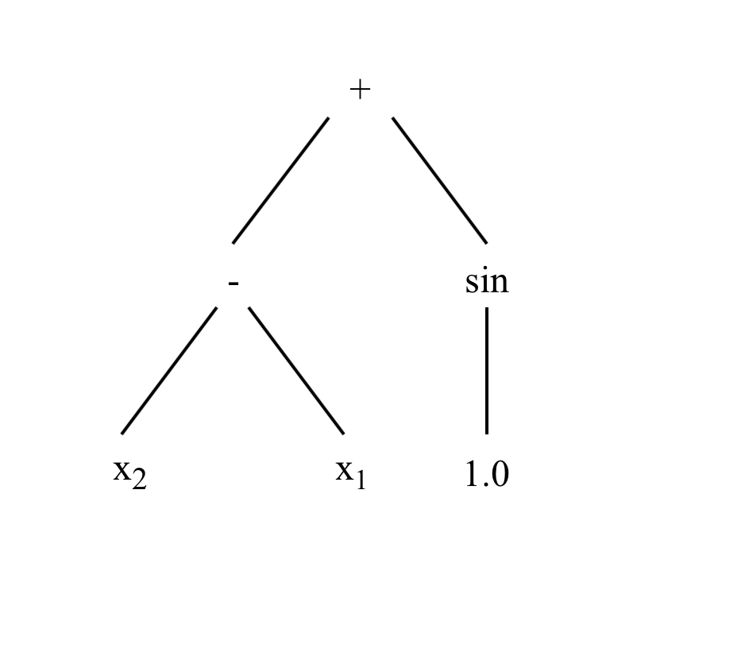
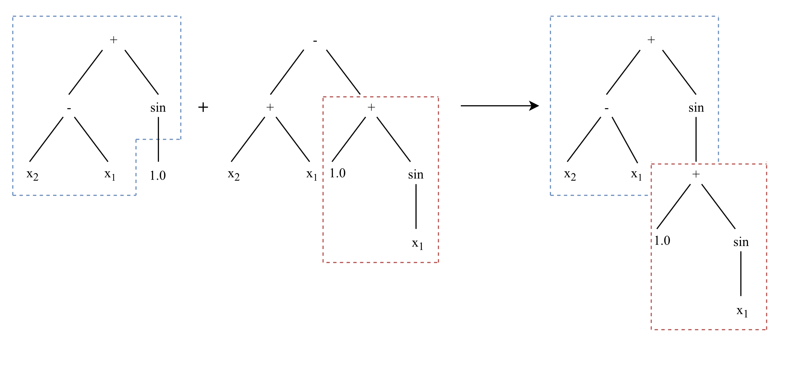
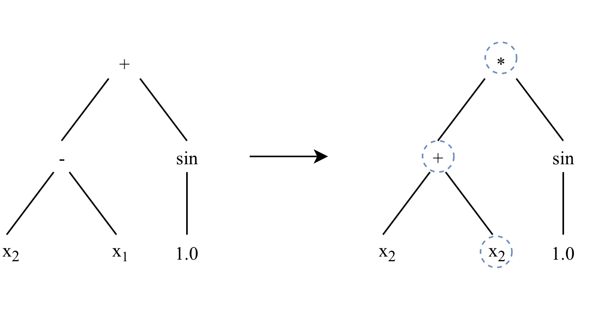
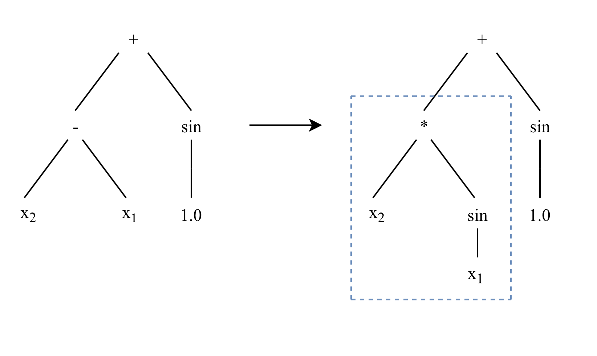
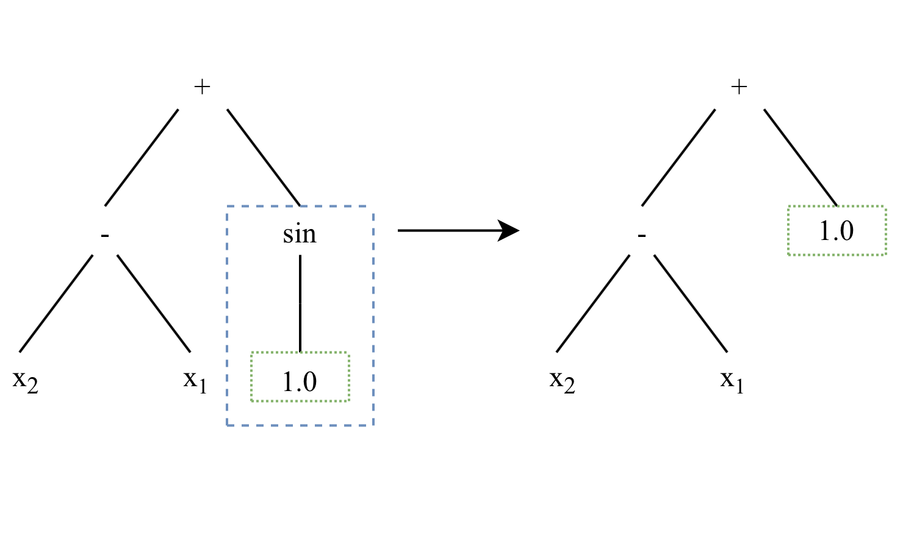

Introduction
************

Genetic Programming
===================

The fundamental concept of genetic programming borrows ideas from evolution in order to take a set of randomly generated programs and train them towards a particular target function through selection, reproduction, and mutation.

The process has a large amount of randomness to it, in that the initial program solutions are random and then those initial programs are randomly selected, reproduced and mutated to form other solutions.

Representation
--------------

KGP uses a tree-based genetic programming approach to find solutions to problems. This means that programs in the KGP are represented as tree structures,

A KGP program consists of a set of nodes that are arranged in a tree structure. There are two main types of nodes that trees can be made up of:

**Functions**

Function nodes represent some kind of operation on it's child nodes. A function has a specified arity, which determines how many child nodes it can have. An example of a function may be the addition operation (:math:`x + y`), which takes two arguments (:math:`x` and :math:`y`) thus it has an arity of two.

KGP provides a set of default functions which can be used, but for situations where custom functions are needed, the abstract class ``kgp.tree.Function`` can be implemented to define a custom operation.

**Terminals**

Terminal nodes are those that don't have any child nodes - that is, they have an arity of zero. KGP is aware of two variations of terminal nodes: *Inputs* and *Constants*.

Inputs are terminal nodes whose value is determined by some feature of the data set being used to train the population. These nodes can be thought of as variables in an expression - e.g. the :math:`x` in :math:`x + 2`.

Constants are terminal nodes whose value is fixed meaning that every time it is evaluated, the value is the same.

When using KGP, the function and terminal nodes that are available to be used need to be defined. An example of a tree that may be generated by KGP is given below. The function and terminal sets used are given as well.

.. math::

    Functions = \{+, -, sin\}\\
    Terminals = \{x_1, x_2, 1.0\}

Internally, KGP trees are actually structured as a flat list of nodes. This is done in an attempt to speed up the various genetic operators such as reproduction and mutation as the list can be traversed linearly rather than managing child pointers in an explicit tree structure. Another consideration that favours the list representation is that the nodes of the tree will stored in a contiguous sequence of memory, meaning greater cache locality as chunks of children node can be kept in the cache.

Closure
-------

An important part of genetic programming is that the trees are randomly created and evolved, meaning that they could take any particular shape and arrangement of nodes. This is fine in most cases, but sometimes there are functions that need to protected from certain inputs, for example division where the second argument is zero would give a divide by zero error resulting an infinite value.

To alleviate this issue, KGP uses protected functions for any operations which may have undefined input. In the core library, only the division function node is protected (against the divide by zero case). However, it is important then when defining custom functions that this property is preserved and that any functions which could potentially give an undefined result are protected.

Sufficiency
-----------

Another important property of genetic programming is that the representation (in KGP's case a tree of function and terminal nodes) is capable of expressing solutions to the problem.

KGP doesn't provide any functionality to help fulfill the sufficiency requirement as it will be dependent on the particular problem and to be tuned by the user.

Initialisation
--------------

The first phase of starting a genetic programming session is initalisation. This phase is concerned with constructing an initial population of programs that are completely random in nature. Because they have no awareness of the function they are targeting, the initial population should be a uniform distribution of the selected function and terminal nodes.

There are three main parameters that influence the initialisation process:

1. Maximum Depth
2. Function and Terminal sets
3. Initialisation Method

The maximum depth determines how large the trees should be in terms of their depth. This essentially sets an upper bound on the number of levels program trees should have.

The function and terminal sets directly effect the kinds of trees that are generated. In a case where a large amount of input variables are used by the data set, it might be beneficial to use deeper trees so that more complex solutions can be created.

KGP provides three methods for tree initialisation:

**Grow Method**

The grow method chooses nodes at random from the union of the function and terminal sets until the maximum depth is reached where it chooses only from the terminal set. This method tends towards asymmetrical trees as there is a possibility of terminal nodes being chosen before the maximum depth is reached.

**Full Method**

The full method chooses nodes from the function set until the maximum depth is reached. When the maximum depth is reached nodes are chosen only from the terminal set. This method generates symmetric trees that are *bushy* - that is, they are very dense at each level above the maximum depth because each node is a function node.

**Ramped Half-and-Half**

The ramped half-and-half method generates trees without half being generated using the grow method and half generated using the full method. This is done in an attempt to increase the diversity of the programs in the initial population.

Selection
---------

The initialisation phase creates a population of programs using some initialisation method. The next phase is to choose a subset of these programs which will undergo evolution before moving to the next generation.

KGP uses tournament selection to choose a subset of individuals from the population size. The number of individuals which compete in the tournaments can be controlled explicitly by the user.

It is important to note that the size of the tournaments directly effects the selection pressure. When large tournaments are held, it means there is a greater chance of programs with a better fitness getting through and the system will converge more quickly. A smaller tournament size however can lead to more diversity in the population meaning that *better* solutions are found. The amount of selection pressure required depends on whether it is acceptable to trade potentially weaker solutions for faster convergence.

Genetic Operators
-----------------

At each generation, a subset of individuals are chosen using tournaments are described previously. Before moving to the next generation, the selected individuals are altered through the application of genetic operators. The genetic operators supported by KGP are detailed below:

**Crossover**

Crossover is the primary method that is used to exchange genetic material between individuals in the population. To perform crossover, two individuals must be selected from the population.

In KGP's implementation a winner of tournament selection (*parent*) undergoes crossover with another tournament winner (*other*). The operator chooses a random subtree of the parent tree and a random subtree from the other tree and swaps the subtrees.

Note that only the parent tree is altered as it has one of it's own subtrees exchanged with one from the other tree.

**Point Mutation**

Point mutation is a simplistic mutation operator that selects a portion of a program's nodes to be replaced by other nodes. A point mutation can increase diversity as it can reintroduce functions or terminals not chosen during initialisation.

A function node to be replaced is exchanged with a function node that has the same arity. A terminal node is replaced by any other terminal node. In the case of a constant terminal node, a small amount of Gaussian noise is added to the value of the constant. KGP uses a replacement rate parameter which determines how the average number of nodes that should be replaced when a point mutation is applied.

**Subtree Mutation**

Subtree mutation is a fairly destructive genetic operator which works by choosing a random subtree of a program and discarding it so that it can be replaced by another randomly generated tree.

Subtree mutation has the potential to increase diversity of the population by reintroducing function and terminal nodes.

**Hoist Mutation**

A hoist mutation is used by KGP as a method of controlling the size of programs (known as *bloat*). It always removes some amount of genetic material from an individual and thus decreases the program size.

Hoist mutation operates by choosing a random subtree (:math:`subtree_1`) of a program selected through tournament selection, and then chooses another random subtree (:math:`subtree_2`) from :math:`subtree_1`. It then replaces :math:`subtree_1` by :math:`subtree_2`, meaning that subtree of the original program is shortened - or *hoisted* up.

Evaluation
----------
