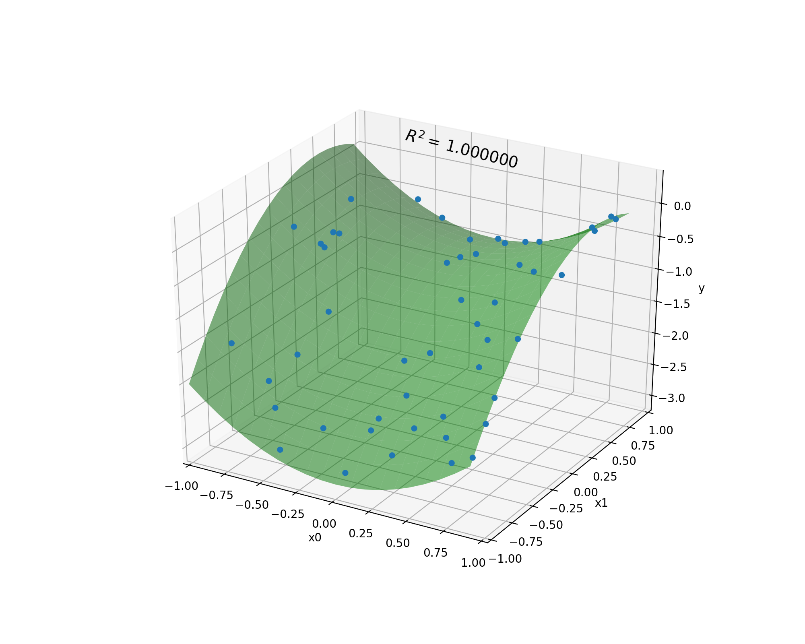

Usage
*****

Model
=====

KGP provides a model interface that can be used to facilitate evolution. Essentially, a model is composed of a population and some way to train and test the model.

KGP provides a base model implementation which contains a basic evolutionary search algorithm. To get started with the base model, a set of evolution options need to be decided upon. The base model is found in the ``kgp.evolution`` package and is an implementation of the ``Model`` interface from the same package.

Evolution Options
=================

Evolution options are used to configure the base model to perform a certain way and choosing the options to be used is the first step to creating a model. The various options are described here:

**Population Size**
    The number of potential solutions the model has at any one time during evolution. A larger population takes longer to evaluate but can potentially have greater diversity.

**Generations**
    The number of times to perform the evolutionary process on the population. More generations generally leads to better solutions being found at the cost of a higher runtime.

**Tournament Size**
    How many individuals from the population should participate in tournament selection. A standard tournament selection operator is used. A larger tournament size will favour the fitter individuals of the population.

**Crossover Rate**
    The probability with which crossover will occur between two individuals selected using tournament selection from the population at each generation.

**Subtree Mutation Rate**
    The probability with which a subtree mutation will be performed on an individual selected using tournament selection at each generation.

**Hoist Mutation Rate**
    The probability with which a hoist mutation will be performed on an individual selected using tournament selection at each generation.

**Point Mutation Rate**
    The probability with which a point mutation will be performed on an individual selected using tournament selection at each generation.

**Point Replacement Rate**
    The frequency with which points should be chosen for a point mutation. Dictates the average number of nodes that will be replaced in a tree that is subjected to a point mutation.

**Number of Offspring**

    The number of individuals taken from each generation to have genetic operators applied to them. Generally this can be set to the same value as the tournament size, but for greater control it can be configured independently.

**Function Set**

    The functions that can be used to construct trees for the initial population or during a subtree/point mutation.

**Tree Generation Options**

    Determines how trees are generated for the population. This includes the maximum depth of trees, the number of features (i.e. input terminal nodes) and constants (i.e. constant terminal nodes), as well as the tree generation method (grow, full, half-and-half).

**Metric**

    A metric that can be used to evaluate solutions. This is essentially a wrapper around a fitness function definition, allowing for custom fitness functions to be used where applicable. Otherwise, a metric can be chosen from the ``kgp.fitness.FitnessFunctions`` object.

**Stopping Threshold**

    Allows for a configurable threshold to be set for solutions which are deemed *good enough*. When an individual from the population has a fitness lower than the threshold, the evolution process will stop.

An example set of evolution options is given below:

.. code-block:: kotlin

    val evolutionOptions = EvolutionOptions(
            populationSize = 1000,
            generations = 1000,
            tournamentSize = 20,
            crossoverRate = 0.7,
            subtreeMutationRate = 0.1,
            hoistMutationRate = 0.05,
            pointMutationRate = 0.1,
            pointReplacementRate = 0.05,
            numOffspring = 10,
            functionSet = listOf(
                Nodes.Addition(),
                Nodes.Subtraction(),
                Nodes.Multiplication ()
            ),
            treeGeneratorOptions = TreeGeneratorOptions(
                maxDepth = 5,
                numFeatures = 2,
                constants = listOf(-1.0, 0.0, 1.0),
                mode = TreeGenerationMode.HalfAndHalf
            ),
            metric = FitnessFunctions.mae,
            stoppingThreshold = 0.01
    )

Note that ``numOffspring`` is set to 10 while ``tournamentSize`` is set to 20. This essentially means that 10 tournaments with 20 contenders will be performed. Also, we set the ``stoppingThreshold`` to 0.01 meaning that if a solution with a fitness of <0.01 is found the evolution process will halt.

Cases
=====

Before the model can be trained, we need to define cases which can be used to evaluate the solutions and drive them towards the target function.

To use cases in KGP, a case needs to first be broken up into a set of *features* (inputs) and a *target* (output). These can then be encapsulated using the ``kgp.fitness.Case`` class which is comprised of a list of features and an output value. These cases can then be loaded into a program and evaluated as part of a fitness function.

Typically to define cases for a problem using KGP, a ``kgp.fitness.CaseLoader`` will be defined that can provided a collection of cases on request. This allows the process to be encapsulated as cases could come from a variety of locations (file, database, etc).

An example case loader for the function :math:`x_0^2 - x_1^2 + x_1 - 1` has been given below. The cases are evenly distributed points in the range :math:`[-1, 1]`.

.. code-block:: kotlin

    val caseLoader = CaseLoader {
        // The truth function.
        val f: (Double, Double) -> Double = { x0, x1 ->
            Math.pow(x0, 2.0) - Math.pow(x1, 2.0) + x1 - 1.0
        }

        val range = UniformlyDistributedSequenceGenerator()

        override fun loadCases(): Cases {
            val seq = range.generate(200, -1.0, 1.0)

            // Define feature variables in the range [-1, 1].
            val x0s = seq.take(100).map { x0 ->
                Feature(x0, "x0")
            }

            val x1s = seq.take(100).map { x1 ->
                Feature(x1, "x1")
            }

            // Map the features to their outputs.
            val cases = x0s.zip(x1s).map { (x0, x1) ->
                val y = this.f(x0.value, x1.value)

                // Make a case for this set of features and output.
                Case(listOf(x0, x1), y)
            }.toList()

            return cases
        }
    }

Now that we've defined the options for the evolution model and have a set of cases that can be used to train the model, we can create a model and train it:

.. code-block:: kotlin

    val model = BaseModel(evolutionOptions)

    model.train(caseLoader.loadCases())

    println(model.best)

An example solution for the problem defined above is given below in LISP format:

.. code-block:: lisp

    (- x1
       (+
         (- (* x1 x1) x0)
         (+
           (- (+ 0.0 1.0)
              (* x0 x0))
           (/ x0
              (+ 1.0 0.0)))))

To see how well this solution matches the target function we can plot the two along with the coefficient of determination (:math:`R^2`). The green surface in the plot below is constructed by applying the truth function :math:`x_0^2 - x_1^2 + x_1 - 1` to values in the range :math:`[-1, 1]` spaced with intervals of 0.1. The blue points are the output of the predicted program on a set of 100 points uniformly distributed between :math:`[-1, 1]`.

This allows us to the see the shape of the function alongside the programs predictions. This program achieves a :math:`R^2` score of 1.0, indicating that the solution perfectly matches the target function.

Indeed, if we expand the program out in terms of its underlying mathematical expression we can see that the predicted function and the true function are the same:

.. math::

    x_1 - (((x_1 \times x_1) - x_0) + (((0 + 1) - (x_0 \times x_0)) + (\frac{x_0}{(1 + 0)})))

    x_1 - ((x_1^2 - x_0) + ((1 - x_0^2) + x_0))

    x_1 - (x_1^2 + (-x_0 + x_0) + ((1 - x_0^2)))

    x_1 - (x_1^2 + ((1 - x_0^2)))

    x_1 - (x_1^2 + 1 - x_0^2)

    x_1 - x_1^2 - 1 + x_0^2

    x_0^2- x_1^2 + x_1 - 1
